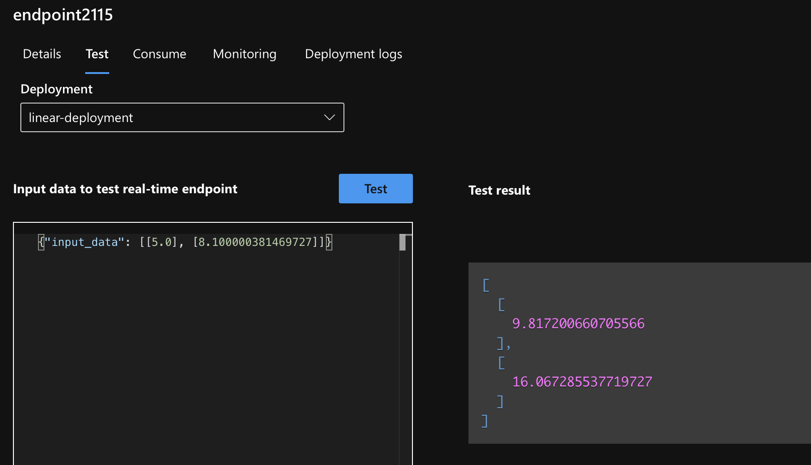

# mlflow-pytorch-simple-example
A simple example of a locally trained PyTorch model, which is registered and used to create a real-time
endpoint in Azure ML. The end goal is to have a real-time endpoint in Azure ML for inferencing. A sample view
of the final state is shown below.

## Steps
- Ensure you have a file called `sub.env` in the root with `SUB_ID=<your subscription id>`.
- Follow the steps in the `Makefile` to reproduce a similar outcome.
